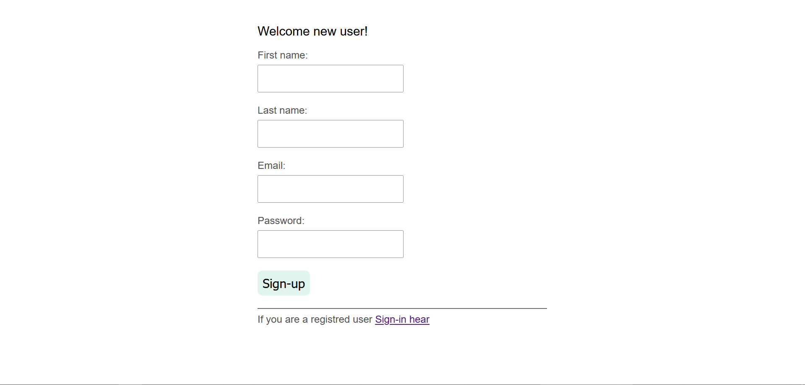
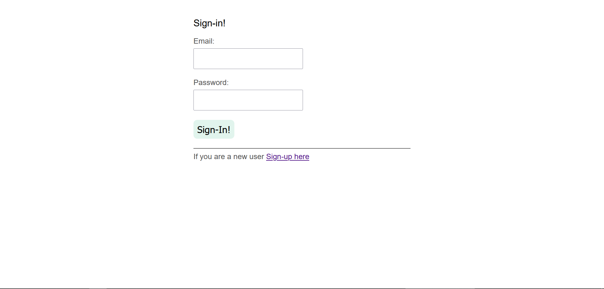
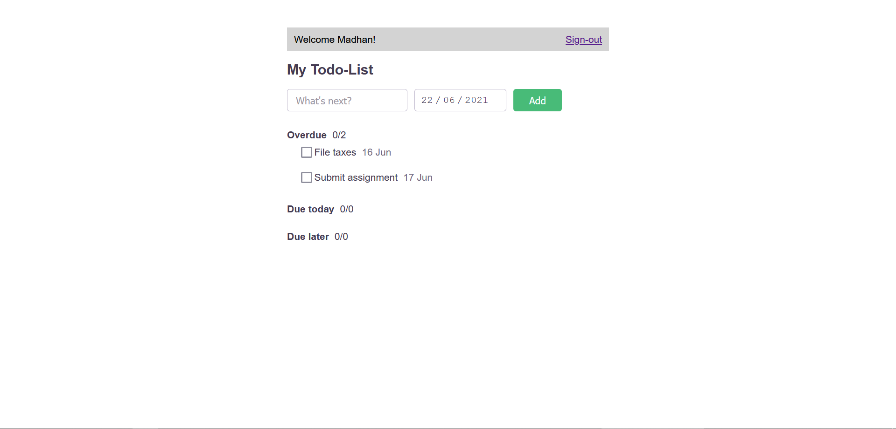

# [Todo Manager](https://madhana-todo-manager-saas-201.herokuapp.com)

 This app is built to store user's todos and a user can view or make changes in their own todos. A use who is not signed-in, has no access to any data. To use this app a user must [sign-up](https://madhana-todo-manager-saas-201.herokuapp.com/users/new) first.

## Sample

> * E-mail: test@email.com
> * Passwors: test

## Home page

## Sign-up page

## Sign-in page

## Todos page

